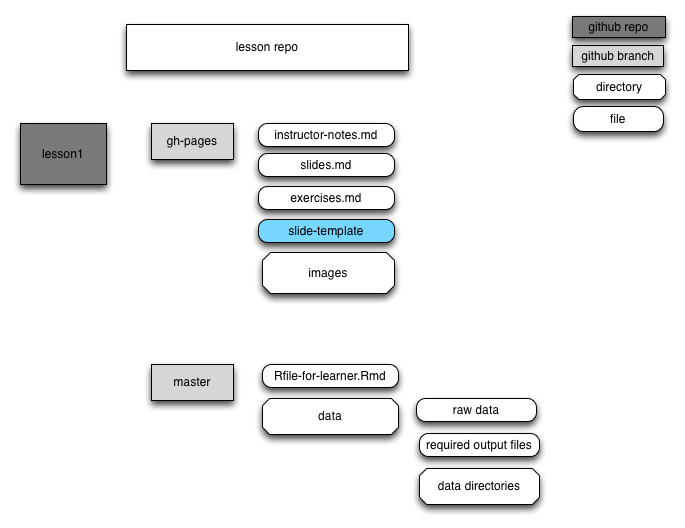
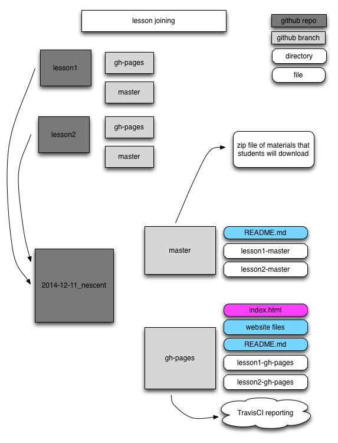

### README

## Notes on the repository structure and how it will be assembled for a workshop

In the Reprodubile Research github organization, each lesson is its own module.

Each lesson module repo has two branches, a gh-pages branch with materials
that the instructor will use and a master branch of materials that the
learners will use.

Repository structure

gh-pages branch
Intructor materials  
- index.md web site for the workshop with location specific information
- instructor notes for the module
- slides that intructors use (slides.md)
- slide template
- list of exercises for the module (exercises.md)
- any R files that instructors want to have, with solutions to exercises for
instance

master branch
Learner materials
- data directory with whatever directory structure is required
- files used in the module, like R files
- (for administration use only) the Travis CI files for testing

R module requirements  
R files should be in Rmd  
A R project file should be included  
(more details needed)  

**Chart of repository structure for each lesson**

There are different people who will interact with this repository

- Master Coordinator: the Master Coordinator is the person who will
set up the initial repository for each workshop and does this for every workshop.
- Instructors: the Instructors are the people who will teach a given workshop

When a workshop is set up the Master Coordinator will run a script that will

- take the all the individual lesson modules that are supposed to be in
the workshop and create one new repository for that workshop with all the
master branches from each lesson repo in one master branch and all
the gh-pages branches from each lesson repo in one gh-pages branch. This
is the 'workshop repository', e.g. 2014-12-11_nescent
- create an index.md file in the top level of the gh-pages branch with the specific
information about the workshop
Things that will be changed:  
  - dates
  - instructors
  - room location
  - accessibility
  - any additional notes, i.e. bring your own lunch

- edit the TravisCI files to be appropriate for the given workshop

**Chart of how multiple repositories will be merged in to one
workshop repository.**

Instructors will now have access to this repository

Instructors should
- fork the workshop repository
- make any changes to the materials in their repository
- either push back changes to the main workshop repository or submit pull requests
(more information needed on how to do this)
- once changes are made, check to see if TravisCI still passes

## Testing

We use [travis-ci](http://travis-ci.org) and [appveyor](http://appveyor.com) to test the lessons.  The idea is that if your lesson has executable code then this will be run on each commit so that you find out if changes have broken anything.

There are several files involved:
* `.travis.yml` and `appveyor.yml` configuration file for travis and appveyor.  Leave this alone, as this is assumed the same across all lessons.
* `.description`: a file like `DESCRIPTION` (dcf format) that lists package dependencies.  Other fields are ignored, but we may hijack these later.
* `.ci_check.R`: a script that will be run to check that the output from running the lesson is OK.  Things to check for include - knitr documents are runnable, running a script produces expected outputs, data sets are actual subsets of other data sets.

For each lesson, tests will be run every time the repo is pushed to github. When lessons are merged, the tests will be merged and all tests will be run.
